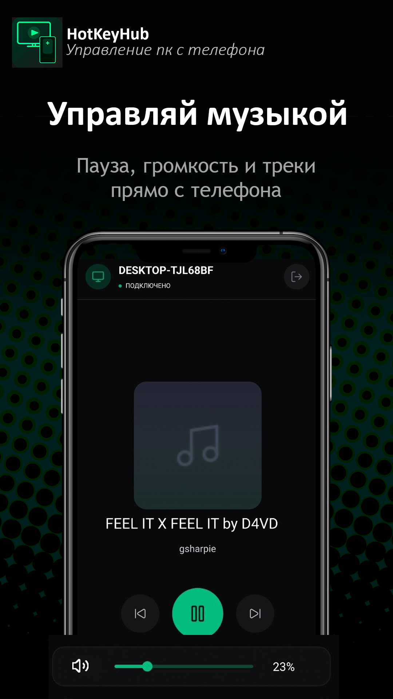
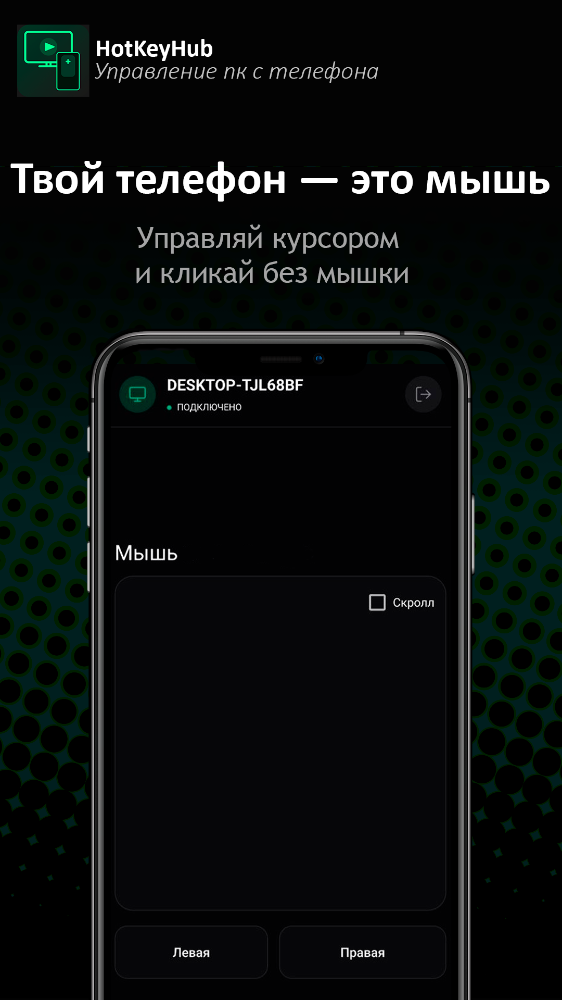
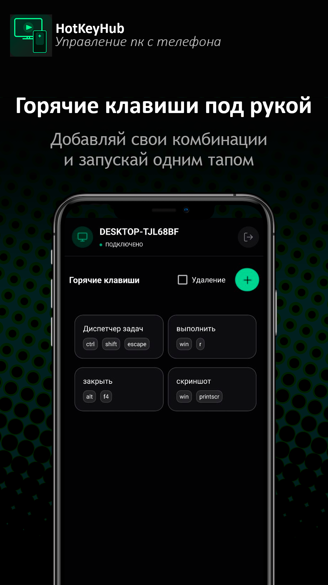

# 🖥️ HotKeyHub

**Превратите смартфон в пульт управления вашим ПК**

---

## 📱 О приложении

**HotKeyHub** — Android-приложение, которое превращает телефон в беспроводной пульт для ПК.  
Управляйте горячими клавишами, мышью и медиаплеером.

---

## ✨ Возможности

### ⌨️ Горячие клавиши
- Создавайте собственные комбинации клавиш
- Запускайте любые действия на ПК одним тапом

### 🖱️ Трекпад
- Используйте экран телефона как тачпад
- Левый и правый клик
- Режим скролла

### 🎵 Медиауправление
- Пауза / Воспроизведение / Следующий / Предыдущий трек
- Регулировка громкости
- Отображение текущего трека

---

## 📸 Скриншоты

| Медиа | Трекпад | Горячие клавиши |
|:---:|:---:|:---:|
|  |  |  |

---

## 🚀 Как начать

1. Скачайте приложение из [RuStore](https://www.rustore.ru/catalog/app/org.qtproject.hotkeyapp)
2. Установите серверную часть на [ПК](https://github.com/eyesonme07/HotKeyHub-Host/releases)
3. Подключите телефон и ПК к одной Wi-Fi сети
4. Запустите приложение — готово ✅

---

## 🛠️ Стек технологий

| Компонент | Технология |
|---|---|
| Android-приложение | Qt 6, QML, C++, Boost|
| Сборка | CMake |
| База данных | SQLite |
| Связь | TCP/IP (локальная сеть) |

---

## 🔗 Ссылки

- 📦 [RuStore — скачать приложение](https://www.rustore.ru/catalog/app/org.qtproject.hotkeyapp)

---
